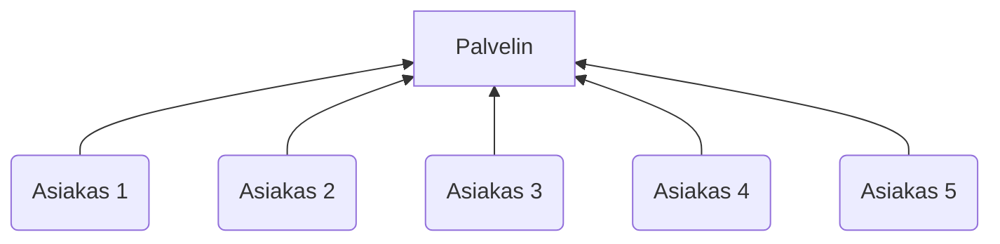
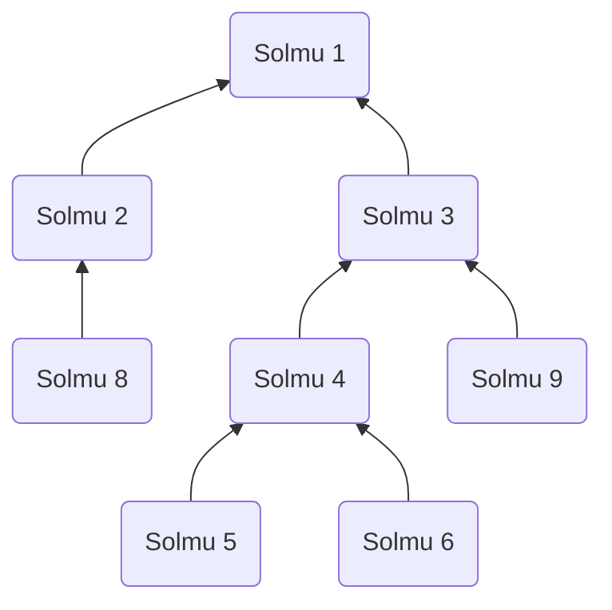

# Mesh-verkko
Ennen siirtymistä Mesh-verkkojen määritelmään, on hyvä huomioida, että Mesh-toteutuksen luonnissa ei tulisi käyttää yhtäkään Gorillapelin luokkaa, vaan tarkoitus on toteuttaa geneerinen verkkokerros, joka pystyy välittämään dataa siihen liittyneiden vertaisten kesken. Gorillapeli muokataan myöhemmissä vaiheissa käyttämään Mesh-toteutusta. Periaatteessa kehityksen ajaksi `Main`-luokan `main()`-metodista voi kommentoida graafisen käyttöliittymän käynnistymisen pois ja testata Mesh-toteutusta ilman Gorillapelin käynnistystä. Itse mesh-toteutuksen luokat suositellaan toteuttamaan omassa pakkauksessaan, esimerkiksi `fi.utu.tech.distributed.mesh`.

## Asiakas–palvelin -malli
Kontrastina toteutettavaan Mesh-rakenteeseen, yksi yleisimmistä tavoista toteuttaa verkkopalveluita on ns. asiakas–palvelin -malli, jossa usea asiakas (tehtävän kontekstissa peli) muodostavat yhteyden yhteen palvelimeen. Asiakas lähettää viestinsä palvelimelle ja palvelin puolestaan asiakkaille: asiakkaat eivät ikinä kommunikoi palvelimen ohi tai välitä viestejä (applikaatiotasolla) toisen palvelimen/asiakkaan kautta.

Palvelin on näissä ratkaisuissa myös taho, joka loppupeleissä päättää pelin yhteisistä asetuksista, kuten pelaajien maksimimäärästä tai rakennusten sijainnista. Monessa pelissä on mukana niin palvelin- kuin asiakaskomponentitkin, mutta vain yksi pelaajista pystyttää palvelimen, johon muut yhdistävät käyttäen palvelimen IP-osoitetta.

Esimerkkinä asiakas–palvelin arkkitehtuurista voi käyttää [distributed-chat -keskustelusovellusta](https://gitlab.utu.fi/tech/education/distributed-systems/distributed-chat), jossa asiakas lähettää viestejä palvelimelle, joka puolestaan välittää viestit muiden keskustelijoiden asiakasohjelmille. Yleistä lisätietoa sockettien käytöstä Javassa on myökin saatavilla [example-sockets-sivulla](https://gitlab.utu.fi/tech/education/distributed-systems/example-sockets).


*Graafi eräästä Asiakas–palvelin -verkosta. Nuolet esittävät yhdistämissuuntaa, mutta kommunikaatio on kaksisuuntaista*

## Mesh-malli
Tässä harjoitustehtävässä on kuitenkin hieman eri lähestymistapa: Jokaista Mesh-verkon jäsentä kutsutaan *solmuksi* eli *nodeksi* ja ne ovat ulospäin samanarvoisia toisiinsa nähden. Verkon jokaisen jäsenen tulisi pystyä lähettämään viesti (esimerkiksi olio) kaikille verkon jäsenille (suoraan tai muiden solmujen kautta) tai osoittaa se vain tietylle vastaanottajalle (jonkin id:n tai nimen avulla). Erona asiakas–palvelin -malliin on, että IP-tasolla solmujen ei tarvitse olla suorassa yhteydessä muihin solmuihin tai yhteen palvelimeen, vaan muut Mesh-verkon jäsenet välittävät viestit eteenpäin.

Mallin voi nähdä myös siten, että jokainen solmu on palvelin, joka viestin saatuaan välittää sen kaikille asiakkailleen (sekä palvelimelle, johon kys. solmu on yhdistänyt). Täten Mesh-kerroksen toteutuksessa on erittäin tärkeää tuntea asiakas-palvelin -mallikin.


*Graafi eräästä Mesh-verkosta. Nuolet esittävät yhdistämissuuntaa, mutta kommunikaatio on kaksisuuntaista*

Esimerkki: Tarkastellaan graafia Mesh-verkosta, jossa on 9 solmua. Ensimmäinen solmu, eli *Solmu 1* ei luonnollisesti voi yhdistää kehenkään, vaan kuuntelee pelkästään yhteydenottopyyntöjä. *Solmun 2* tulee yhdistää ensimmäiseen solmuun, sillä muita mahdollisuuksia ei ole (tähän asti siis ei eroa asiakas–palvelin -malliin). Kolmannen solmun liittyessä tapahtuu kuitenkin muutos toimintaan: Sen sijaan, että *Solmu 3* yhdistäisi *Solmuun 1*, voisi hän myös yhdistää *Solmuun 2* ja "ketjuttua" mukaan. Vaikka *Solmu 3* yhdistää esimerkissämme vielä ensimmäiseen solmuun, päättää jo *Solmu 4* yhdistää verkkoon *Solmun 3* kautta.

Jos esimerkkimme mikä tahansa solmu haluaisi nyt lähettää viestin kelle tahansa verkossa, tulisi tämä onnistua, sillä polku on olemassa. 

### Vaatimukset Mesh-kerrokselle
- Kaikkien solmujen tulee pystyä vastaanottamaan viestit kaikilta solmuilta
- Yhden solmun tulee tukea useaa tähän yhdistävää solmua säieturvallisesti
- Viesti tulee pystyä kohdistamaan tietylle solmulle
- Solmujen tulee suodattaa duplikaattiviestit sekä heille kuulumattomat viestit vastaanottaessa, eikä paljastaa niitä Mesh-verkkoa käyttävälle ohjelmalle
- Liitosten ei tarvitse olla redudantteja: Tilanteessa, jossa vertainen häviää verkosta, sallitaan, että kaikki tämän vertaisen kautta yhteydessä olevat irtoavat myös Mesh-verkosta
- Mesh-kerroksen tulee luovuttaa vastaanotettu validi, solmulle kuuluva tieto, Mesh-verkkoa käyttävälle ohjelmalle (ts. pelille) säieturvallisesti (Tämä selkenee paremmin 3. aliosiossa)

## Vihjeitä työn implementointiin

### Vinkki 1
Mesh-verkkototeutukseen riittää todennäköisesti 3 luokkaa: Yhteyspyyntöjä odottava ja julkisen APIn tarjoava palvelinluokka/pääluokka, vertaiskommunikaatiosta huolehtiva luokka (voi olla sisäluokka, "inner class") sekä Mesh-viestiluokka, jossa lähetettävä tieto kuljetetaan verkon ylise: sisältää viestin otsaketiedot, sekä itse hyötykuorman.

### Vinkki 2
Vertaisten ei tarvitse olla erityisen älykkäitä viestien edelleenvälityksessä. Toisin sanoen, vastaanotetun viestin riittää lähettää eteenpäin kaikille naapureille, mikäli se on vastaanotettu ensimmäistä kertaa. On vastaanottajan vastuulla hylätä viesti, joka on jo nähty tai muuten kelvoton.

### Vinkki 3
Mesh-verkkototeutuksen luokkarakenne ja julkinen liitäntä voisi näyttää seuraavalle:

```java
interface Mesh {
    /**
     * Luo Mesh-palvelininstanssi
     * @param port Portti, jossa uusien vertaisten liittymispyyntöjä kuunnellaan
     */
    public Mesh(int port);
  
    /**
     *  Käynnistä uusien vertaisten kuuntelusäie
     */
    public void run();

    /**
     * Lähetä hyötykuorma kaikille vastaanottajille
     * @param o Lähetettävä hyötykuorma
     */
    public void broadcast(Serializable o);

    /**
     * Lähetä hyötykuorma valitulle vertaiselle
     * @param o Lähetettävä hyötykuorma
     * @param recipient Vastaanottavan vertaisen tunnus
     */
    public void send(Serializable o, long recipient);

    /**
     * Sulje mesh-palvelin ja kaikki sen yhteydet 
     */
    public void close();

    /**
     * Lisää token, eli "viestitunniste"
     * Käytännössä merkkaa viestin tällä tunnisteella luetuksi
     * Määreenä private, koska tätä käyttävä luokka on sisäluokka (inner class)
     * Jos et käytä sisäluokkaa, pitää olla public
     * @param token Viestitunniste 
     */
    private void addToken(long token);

    /**
     * Tarkista, onko viestitunniste jo olemassa
     * Määreenä private, koska tätä käyttävä luokka on sisäluokka (inner class)
     * Jos et käytä sisäluokkaa, pitää olla public
     * @param token Viestitunniste 
     */
    private boolean tokenExists(long token);

    /**
     *  Yhdistä tämä vertainen olemassaolevaan Mesh-verkkoon
     */
    public void connect(InetAddress addr);
}
```
