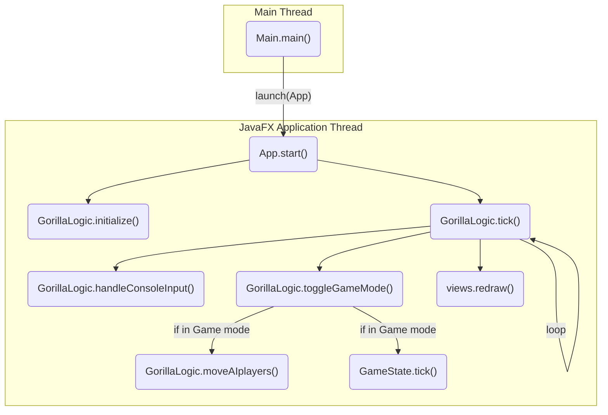

# Ohjelman kulku

## Rakenne
Pelin lähdekoodi on kokonaisuudessaan pakkauksen `fi.utu.tech.distributed.gorilla` alla, mutta se käyttää hyväkseen OOMkit-ohjelmistokehystä ja JavaFX:ää. Luokkien määrä saattaa ensialkuun tuntua massiiviselle, mutta sitä ei ole syytä pelästyä: Tämän työn suorittamisen kannalta oleellista ei ole tuntea kaikkia ohjelman mukana tulevia luokkia tai tuntea graafisten käyttöliittymien toimintaperiaatetta syvällisesti. Pelilogiikka on keskitetty pakkaukseen `fi.utu.tech.distributed.gorilla.logic`, jonka luokkia muokkaamalla ja lisäämällä tehtävänannon vaatimukset pystyy täyttämään.

## Kulku
Ohjelman suoritus käynnistyy `Main`-luokan main-metodista ohjelman pääsäikeessä. Main-metodin ainut tehtävä tässä ohjelmassa on käynnistää graafinen käyttöliittymä JavaFX:n sovellussäikeeseen (JavaFX Application Thread) käyttäen JavaFX:n `launch()` -metodia. JavaFX:n sovellussäie on vastuussa graafisen käyttöliittymän päivittämisestä. Se siis ajaa silmukassa esimerkiksi tapahtumankäsittelyä (tarkistaa, mitä nappeja käyttäjä painaa ja ohjaa tiedon kuunteleville komponenteille) ja ikkunan sisällön piirrosta vastaavia metodeita. Itse renderöinti on toteutettu ulkoisessa säikeessä, mutta sillä ei ole merkitystä tämän tehtävän kontekstissa.

`App`-luokka on graafisen käyttöliittymän "entry point", joka annetaan main-metodin kutsumalle `launch()`-metodille parametrina. Itse luokka sisältää muutamia ohjelman käyttöliittymään lisättäviä painikkeita, mutta paljon toiminnallisuutta on myös piilotettu perittyyn oomkitin OOMApp-luokkaan. Tämän kurssin kontekstissa riittää ymmärtää, että App-luokka (tarkemmin OOMApp) lopulta kutsuu `GorillaLogic`-luokan `initialize()`-metodia, josta ohjelmalogiikkaa kannattaa aloittaa tarkistelemaan. `initialize()`-metodin vastakohtana voidaan pitää `terminate()`-metodia, jota kutsutaan automaattisesti suljettaessa peli-ikkuna. Tämän tiedon pohjalta on mahdollista löytää koodista paikka, jossa mesh-järjestelmä tulisi käynnistää.

Tutkimalla alla olevaa graafia ohjelman toiminnan kulusta sekä samalla seuraamalla ohjelmakoodia, on mahdollista pienellä vaivalla löytää chat-viestien lähettämiselle sopiva paikka. `GorillaLogic` -luokan muokkaamisen sijaan voi halutessaan periä kyseisen luokan `GorillaMultiplayerLogic`-luokaksi ja tehdä kaikki muutokset tähän luokkaan. Tällöin `GorillaLogic` pysyy muuttumattomana. `GorillaMultiplayerLogic` tulee muistaa ottaa käyttöön `App`-luokassa!

*Ohjelman kulku työn kannalta oleellisilta osin (Renderöityy GitLabissa)*

# Chat-viestiominaisuuden vaatimukset (2. osio)
- Ohjelma osaa lähettää Chat-viestin kaikille mesh-verkossa `ChatMessage`-oliossa
- Viesti lähetetään käyttäen say-komentoa pelin konsolissa
- Viesti tulostuu kaikilla käyttäjillä ainoastaan kerran (Tämä tulisi olla jo Mesh-tasolla hoidettu!)
- Viesti saadaan purkaa tässä vaiheessa Mesh-serverillä ja tulostaa konsoliin.[^1] Korjattava viim. 3. kohdassa!

[^1]: Vastaanottaessa Chat-viestejä, riittää aluksi tulostaa viestit suoraan konsoliin vastaanottaessa. Kuitenkin kannattaa alkaa miettimään, miten tulostuksen voisi hoitaa `Gorilla(Multiplayer)Logic`-luokan sisässä, sillä Chat-viestien tulostaminen edellyttää `*.gorilla.logic`-pakkauksen luokkia, joista emme Mesh-toteutuksessa halua pidemmän päälle riippua. Toiseksi, muut JavaFX-säikeen rakenteet eivät välttämättä ole yhtä suopeita, mikäli ulkoiset säikeet sorkkivat tietorakenteita.
